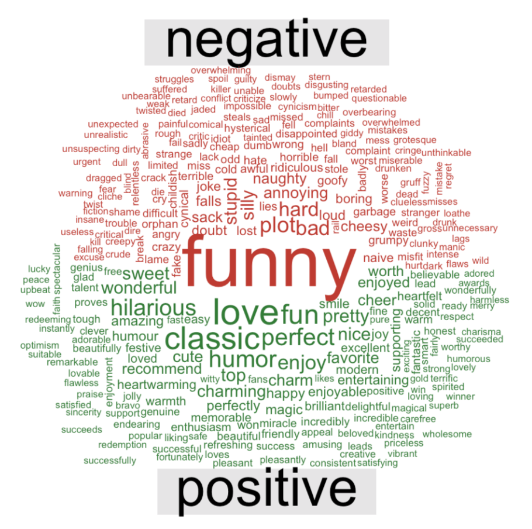
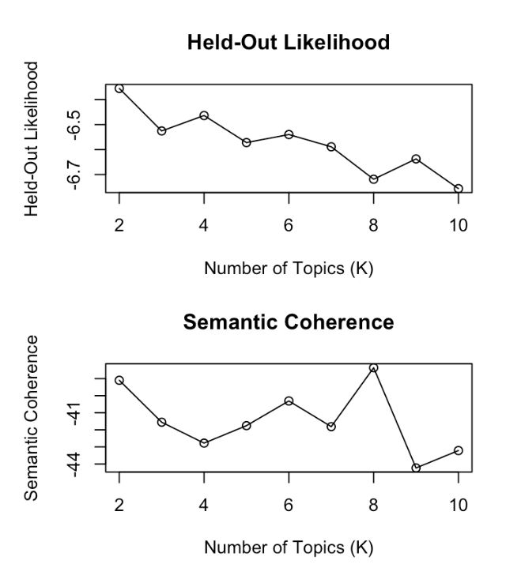
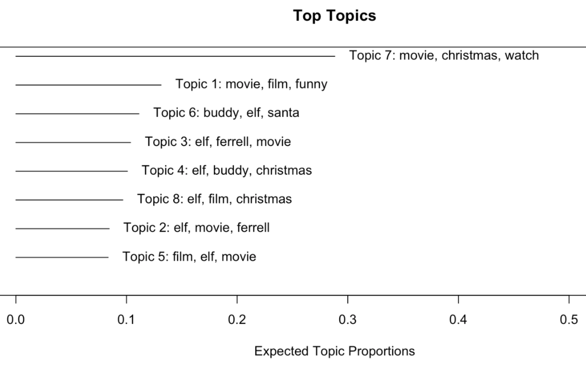
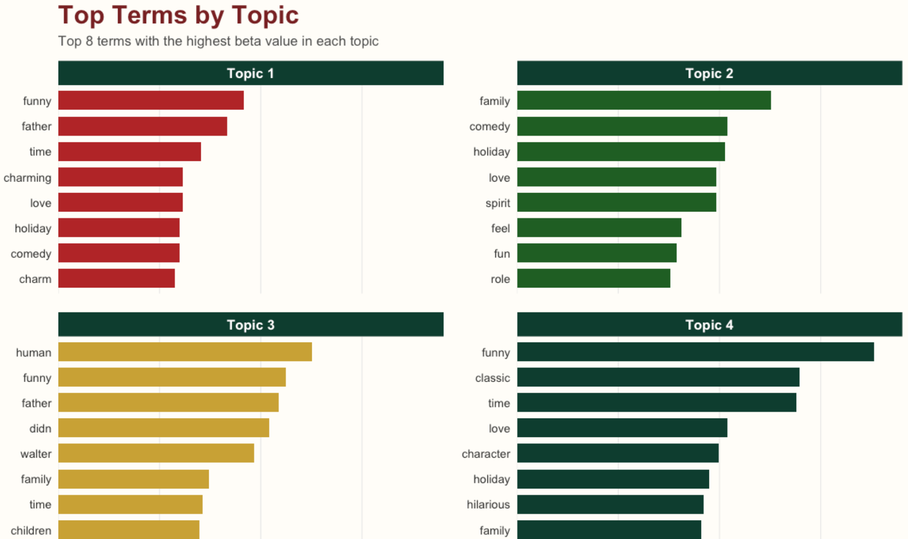

## Agenda

::::::::::::::: columns
::::: {.column width="25%"}
:::: fragment
{width="100%" fig-alt="A cartoon-style vertical illustration shows Tina Kotek standing in an Oregon Employment Department meeting room and asking, “Can your team analyze this survey data?” Three analysts sit around a table with a laptop, notebook, and simple chart printouts. An OED sign is on the wall, and the Oregon State Capitol is visible through the window."}

::: {style="text-align: center;"}
**The Challenges**
:::
::::
:::::

::::: {.column width="25%"}
:::: fragment
::: {style="text-align: center;"}
**Basic Workflow & Sentiment Analysis**
:::
::::
:::::

::::: {.column width="25%"}
:::: fragment
::: {style="text-align: center;"}
**Choosing K**
:::
::::
:::::

::::: {.column width="25%"}
:::: fragment
::: {style="text-align: center;"}
**Topic Modeling**
:::
::::
:::::
:::::::::::::::

## The Challenges of Open Text Response Data

:::::::: {style="text-align: center; font-size: 1.35em; margin-top: 1em;"}
::: fragment
**Tight timeline**
:::

::: fragment
**4,000+ open-ended responses**
:::

::: fragment
**Small review team**
:::

::: fragment
**Manual review can be inconsistent**
:::

::: fragment
**Pre-defined categories can shape what reviewers look for**
:::
::::::::

## Step 1: Clean the Data

```{r}
#| echo: true
#| code-line-numbers: "1|2|3-5|6-9"

library(tidyverse)
clean_text <- function(raw_data, text) {
  raw_data |>
    mutate(
      text_clean = {{ text }} |>
        str_to_lower() |>
        str_replace_all("<br\\s*/?>", " ") |>
        str_replace_all("[^a-z0-9\\s]", " ") |>
        str_squish()
    )
}
```

## Step 2: Tokenize the Text

```{r}
#| echo: true
#| code-line-numbers: "1|2|3-4|5"
library(tidytext)
tokenize_text <- function(clean_data) {
  clean_data |>
    unnest_tokens(word, text_clean) |>
    anti_join(stop_words, by = "word")
}
```

## Step 3: Term frequencies

```{r}
#| echo: true
#| code-line-numbers: "1|2-3"
term_frequencies <- function(tokenize_data) {
  tokenize_data |>
    count(word, sort = TRUE) 
}
```

## Term Frequencies Example

```{r}
#| warning: false
#| echo: true
#| code-line-numbers: "1|2|3|4|5"
elf <- read_csv("data/elf_reviews_text_only.csv")
clean_elf <- clean_text(elf, review_text)
tokenize_elf <- tokenize_text(clean_elf)
term_frequencies_elf <- term_frequencies(tokenize_elf)
term_frequencies_elf
```

## Step 4: Sentiment analysis

```{r}
#| echo: true
#| code-line-numbers: "1|2|3-4|5|6-9|10|11|12"
library(wordcloud)
sentiment_wordcloud <- function(tokenize_data, lexicon = "bing") {
  tokenize_data |>
    inner_join(get_sentiments(lexicon), by = "word") |>
    count(word, sentiment) |>
    pivot_wider(
      names_from = sentiment, 
      values_from = n, 
      values_fill = 0) |>
    column_to_rownames("word") |>
    comparison.cloud(colors = c("#C0392B", "#2E7D32"))
}
```

## Word Cloud Example

```{r}
#| warning: false
#| echo: true
#| eval: false
#| code-line-numbers: "1|2"
wordcloud_elf <- sentiment_wordcloud(tokenize_elf)
wordcloud_elf
```

```{r}
#| warning: false
wordcloud_elf <- sentiment_wordcloud(tokenize_elf)
invisible(wordcloud_elf)
```

## Step 5: Prepare Data for Model

```{r}
#| echo: true
#| code-line-numbers: "1|2|3-5|6-8|5|6-8"
library(stm)
stm_data <- function(tokenize_data) {
  dtm <- tokenize_data |>
    count(row_id, word) |>
    cast_sparse(row_id, word, n)
  readCorpus(
    as.matrix(dtm),
    type = "dtm"
  )
}
```

## Step 6: Choosing K

```{r}
#| echo: true
#| code-line-numbers: "1|2-6"
search_topics <- function(stm_data, k) {
  searchK(
    documents = stm_data$documents,
    vocab = stm_data$vocab,
    K = k
  )
}
```

::: fragment
### Considerations
:::

::: fragment
1.  Where does held-out mostly plateau?
:::

::: fragment
2.  Where does residuals mostly level off?
:::

::: fragment
3.  Where are exclusivity and coherence both reasonable?
:::

## Choosing K Example

```{r}
#| cache: true
#| echo: true
#| eval: false
#| code-line-numbers: "1|2|3"
stm_elf <- stm_data(tokenize_elf)
search_k_elf <- search_topics(stm_elf, 2:10)
plot(search_k_elf)
```

```{r}
# dir.create("model", showWarnings = FALSE)
# saveRDS(search_k_elf, "model/search_k_elf.rds")
search_k_elf <- readRDS("model/search_k_elf.rds")
plot(search_k_elf)
```

## Step 6: Topic Model

```{r}
#| echo: true
#| code-line-numbers: "1|2-7"
model_data <- function(stm_data, k) {
  stm(
    documents = preped_data$documents,
    vocab = preped_data$vocab,
    K = k
  )
}
```

## Topic Model Example

```{r}
#| cache: true
#| echo: true
#| eval: false
#| code-line-numbers: "1|2"
model_elf <- model_data(stm_elf, k = 8)
plot(model_elf)
```

```{r}
model_elf <- readRDS("model/model_elf.rds")
plot(model_elf)
```

## Conclusion

::: fragment



:::
